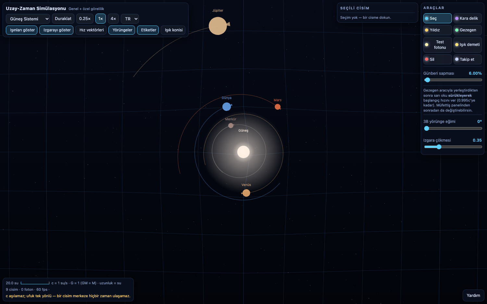
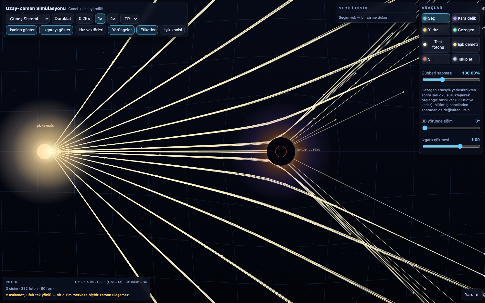
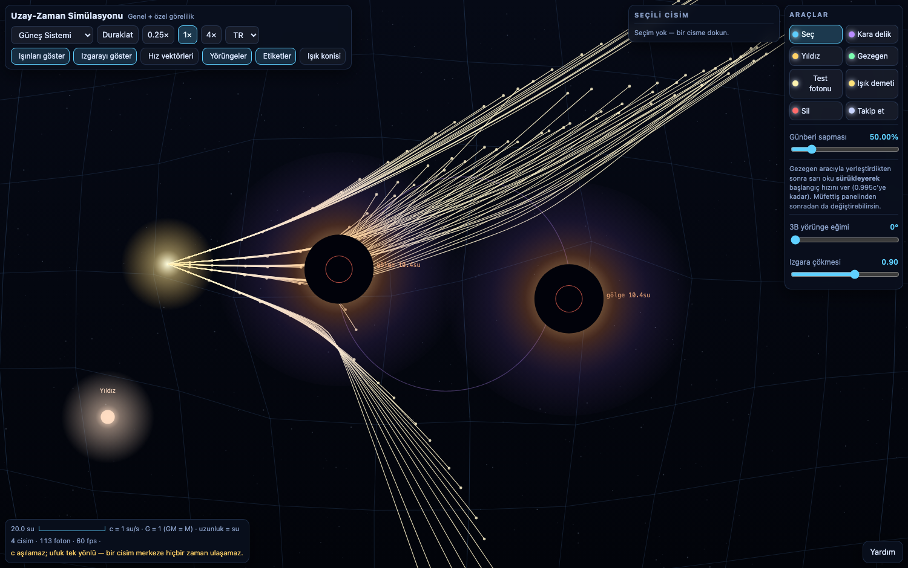

# Uzay-Zaman Simülasyonu

**Tarayıcıda çalışan, tek dosyalık (HTML + Canvas) genel ve özel görelilik simülasyonu.**
Harici bağımlılık, derleme adımı veya sunucu yok — `index.html` dosyasını açman yeterli.

[Canlı demo (GitHub Pages)](https://eymndev.github.io/space-time-sim/)

---

## Ne yapıyor



- **Genel görelilik:** Schwarzschild benzeri merkezî çekim + birinci mertebe (1PN) GR düzeltmeleri.
  Olay ufku, foton küresi, gölge, zaman dilatasyonu, kırmızıya kayma, günberi sapması.
- **Özel görelilik:** ışık hızı tavanı (`c = 1`), boy kısalması ipucu, yerel saat `τ` / uzak gözlemci saati `t` karşılaştırması.
- **Işık sapması:** fotonlar null geodezik olarak çizilir; ışık **2×** yerçekimi hisseder, toplam sapma `4GM/c²`.
- **Çok cisim:** her yıldız, gezegen ve kara delik kendi kütle katsayısını taşır; tam N-gövde entegrasyonu.
- **Arayüz:** Türkçe / İngilizce / Almanca. Dokunmatik destekli, mobilde çalışır.

## Işık sapması



Işın demeti tüm çarpım parametrelerine yayılır. `b < 3√3·M` olan ışınlar gölgeye (kara deliğe) düşer,
kenarındakiler `4M/b` oranında kırılır ve iki yanda iki ayrı görüntü oluşturur — bu, 2B üstten bakış
görünümünde Einstein halkasının karşılığıdır (gerçek halka 3B bir görüntüdür; 2B'de gölgenin kenarıdır).
Ölçülen kırmızı kayma `z = 1/√(1−2M/r)` ile `1.61`'e çıkıyor.

## Çift kara delik



Eşit kütleli ikili, `v = √(GM/2s)` hızıyla "dans eden ufkuklar" çiziyor. Işınlar her iki kütleyi de sarıyor.

---

## Preset'ler

| Preset | İçerik |
|---|---|
| **Güneş Sistemi** | Güneş + Merkür…Neptün. Gerçek kütle oranları, görsel okunabilirlik için sıkıştırılmış yarıçaplar. Merkür'de etiketli günberi sapması. |
| **Çift kara delik** | `M = 2` kara delikler, karşılıklı yörünge, mercekleme ışınları. |
| **Işık sapması** | `M = 1` kara delik, uzak ışık kaynağı, gölge + Einstein halkası görüntüsü. |
| **Rölativistik uçuş** | `0.85c` düz geçiş (boy kısalması), ufka düşen cisim (donma + yutulma), mercekleme ışınları, kararlı yörüngede günberi sapması. |
| **Boş laboratuvar** | Sadece ızgara. Kendi senaronu kur. |

## Araçlar

| Araç | Ne yapar |
|---|---|
| **Seç** | Cisme dokun → müfettiş paneli: kütle, hız, yarıçap düzenleme; yerel/uzak saat karşılaştırması |
| **Kara delik** | Kütle kaydırıcıyla yerleştir (`M = 10⁻⁶ … 10³`) |
| **Yıldız** | Kütle + sıcaklık (renk kara-cisim yaklaşımıyla) |
| **Gezegen** | Kütle, görsel yarıçap, **sonra sarı oku sürükleyerek başlangıç hızı** (0.995c'ye kadar) |
| **Test fotonu** | Tek foton; en yakın kütleye nişan alır |
| **Işık demeti** | Sürekli ateşleyen kaynak: yayılım, atış hızı, yön |
| **Sil** | Cismi kaldır |
| **Takip et** | Kamera seçili cismi izler |

## Kontroller

| Girdi | Etki |
|---|---|
| Sürükle | Kamera kaydır |
| Tekerlek / iki parmak | Zoom |
| Çift tık | Seçili cismi ortalar |
| `Space` | Oynat / duraklat |
| `1`…`8` | Araç seç |
| `R` | Preset'i sıfırla |
| `Del` | Seçili cismi sil |
| `G` / `V` / `H` | Izgara / hız vektörleri / yardım |

Üstte: `0.25× / 1× / 4×` hız, "Işınları göster", "Izgarayı göster", "Hız vektörleri", "Yörüngeler",
"Etiketler", "Işık konisi" anahtarları. Sağda: 3B yörünge eğimi ve ızgara çökmesi kaydırıcıları.

---

## Fizik modeli

Birimler: **`c = 1` su/s**, **`G = 1`** → gravitasyonel parametre `GM/c² = M`.
Böylece Schwarzschild yarıçapları doğrudan kütleye bağlı çıkar:

| Büyüklük | Değer |
|---|---|
| Olay ufku | `rs = 2M` |
| Foton küresi | `3M` |
| Gölge (kritik parametre) | `3√3·M ≈ 2.60·rs` |
| En iç kararlı yörünge (ISCO) | `6M` |
| Yutma eşiği | `r < 1.02·rs` → don, kızar, **merkeze girme** |

**Entegrasyon.** Yarı-sembolik kick–drift–kick (leapfrog), **tüm ivmeler eşzamanlı (Jacobi)**
hesaplanır. Sıralı (Gauss–Seidel) hesap ikili sistemlerde enerjiyi monotonik artırıp yörüngeleri
dağıtıyordu; eşzamanlı hesap symplectic özelliğini korur. Adım sayısı her karede en yakın/ en baskın
cismin dinamik zamanına göre uyarlanır (tavan 24 alt-adım).

**1PN düzeltmesi.** Merkezî ivmeye eklenen terim:

```
a = −G·M/r²  −  3·exag·G·M·h²/r⁴        (h = r × v)
```

Binet denkleminde `u'' + (1 − 6·exag·M·u₀)u = M/h²` verir, yani yörünge başına

```
Δφ = 6π·exag·GM / (c²·a·(1−e²))
```

Merkür'ün ünlü 43"/yüzyıl sonucunun tam biçimi. `exag = 1` ise tamamen fizikseldir; arayüzdeki
kaydırıcı bunu abartır ve **abartma katsayısı her zaman etiketlenir**.
> Not: yaygın yazılan `−GM/r²(1 + 3GM/c²r)` biçimi yalnızca **3π** verir; `h²` ile ölçeklenen
> `1/r⁴` biçimi gereklidir.

**Zaman ve renk.**
- Yerel saat: `dτ/dt = √(1 − 2M/r − (1−2M/r)v²)` → cisim `τ` sayar, `t` her yerde aynıdır.
- Kırmızı kayma: `z = 1/√(1 − 2M/r)` — yalnızca potansiyele bağlıdır, cismin hızına değil.
- `dτ/dt < 1` olduğunda cisim görsel olarak **donup kızarır** ve ufka yapışır; merkeze hiçbir zaman ulaşmaz.
- Işık: her zaman tam `c`; `r < 3M` içine giren ışık kararsız null geodezikte olduğu için yakalanır.

**Yutma ve büyüme.** Kara deliğe geçen cismin kütlesi `M`'e eklenir, hacim `M^(1/3)` ile büyür
(rad = `rad₀·∛(M/M₀)`). Birleşme **momentum korumalıdır**: `v → (M₁v₁ + M₂v₂)/(M₁+M₂)`, yoksa
kara delik gereksiz sürüklenir ve çevredeki yörüngeler bozulur.

**ISCO içi spiral.** İçeride yörünge kararsızdır: yalnızca **göreli** hız sönümlenir, kaybedilen
momentum `m₁/m₂` oranıyla ev sahibine aktarılır. Lineer momentum korunur, enerji ışıma olarak kaybolur.

---

## Dürüstlük notları (modelin sınırları)

Bunlar bilinçli sadeleştirmelerdir; gizlenmez:

1. **Işık sapması tam null-geodezik çözümü değildir.** Işın, ışığa özgü `2GM/r²` ivme ile
   zayıf alanda bükülür. `4M/b` sapması doğru; yüksek mertebe merceklenme etkileri yok.
2. **1PN birinci mertebe bir genişlemedir.** `exag = 1` iken eksantrik yörüngelerde ufka yakin
   kesme hatası onlarca yüzdeye çıkabilir.Varsayılan değerler (%6) güvenli bölgede.
3. **Izgara çökmesi bir koordinat görselleştirmesidir**, gerçek eğrilik ölçüsü değil:
   genişlik `9·√M·h`, derinlik `0.55·√M·h·sag` ölçekli Lorentzian bir çukur. `√M` sayesinde
   `10⁻⁶ … 10³` kütleler aynı karede okunur; bir gezegenin çukuru fiziksel olarak yok denecek kadar
   küçüktür, ve bu bilinçlidir.
4. **Güneş Sistemi yarıçapları sıkıştırılmıştır** (`a ∝ a_AU^0.6`, 1 AU = 34 su) — aksi hâlde
   gezegenler görünmez olurdu. Dönemler Kepler yasasından gelir (`T ∝ a^{3/2}`), dolayısıyla
   **dönem oranları da sıkışır**: Neptün/Merkür ≈ 51 (gerçek 164). Kütle oranları gerçektir.
5. **Günberi sapması abartılmıştır** (varsayılan ×30). Panelde gerçek değerle karşılaştırılır.
6. **Uzak ışık kaynakları kinematiktir** (`fixed`) — "sabit yıldız" idealizasyonu. Aksi hâlde
   kütleleri ne olursa olsun çekim kuyusuna düşerlerdi ve mercekleme düzeni bozulurdu.
7. **Boy kısalması bir görsel ipucudur** (elips), tam rölatif render değil; Terrell dönmesi modellenmez.
8. **3B eğim yalnızca görseldir**: `z` koordinatı çizim için var, fizik 2B düzlemdedir.
9. **Işık hızı tavanı** `0.995c`'de sayısal güvenlik için kırpılır (fizikî limit tam olarak `c`).
10. "Kütlesiz" cisimler (ışık kaynakları, ışık demetleri) için Newton kuvveti uygulanmaz.

## Performans

Hedef 60 fps. Kare süresi bozulursa foton sayısı ve iz seyreltmesi kısılır —
**mercekleme ve ufuk asla feda edilmez.** 24 alt-adım tavanına takılıp çok sayıda cisim varsa
"fizik kararsız, cisim sayısını azalt" uyarısı çıkar.

## Doğrulama

Headless test paketiyle ölçülenler:

| Deney | Sonuç |
|---|---|
| İzole iki cisim, enerji korunumu (200 yörünge) | `\|ΔE/E\| = 2·10⁻⁷ %` |
| Tam Güneş Sistemi, 90 sn, en büyük yarıeksen sapması | `< %1.5` (4× hızda) |
| Merkür günberi sapması (150 yörünge ölçümü) | ölçülen `3.11°` / model `3.52°` / yörünge |
| Çift kara delik ayrılığı, 120 sn | `60–70 su` kararlı (başlangıç 60) |
| Işık sapması: en yüksek kırmızı kayma | `z = 1.61` |
| Ufka düşen cisim: gözlenen en küçük `dτ/dt` | `0.133` |
| Kara delik büyümesi (yutma) | `M = 3.000 → 3.120` |
| Hızlı geçiş `0.85c` | `L/L₀ = 0.57`, asla `c`'yi geçmedi |

## Tarayıcı desteği

Chrome / Edge / Firefox / Safari (güncel). Mobilde dokunmatik: sürükle, iki parmakla zoom,
dokunarak cisim seç.

---

## English summary

Single-file (HTML + Canvas) spacetime simulation. Newtonian N-body gravity plus first-order
(1PN) general-relativity corrections: event horizon, photon sphere, shadow (`3√3·M`),
time dilation `dτ/dt`, redshift `z = 1/√(1−2M/r)`, and perihelion precession
`Δφ = 6π·exag·GM/(c²a(1−e²))`. Light rays follow null geodesics, feeling **2×** the gravity
(`4GM/c²` deflection), producing the shadow / Einstein-ring picture. Nothing exceeds `c`; bodies
near a hole redden, freeze and can never reach the centre — swallowed mass is added to the
black hole, whose volume grows as `M^(1/3)`.

Five presets (Solar System, binary black holes, light bending, relativistic flyby, empty lab),
eight tools, Turkish / English / German interface, touch support.

**Caveats:** the grid sag is a coordinate visualisation, not curvature. Solar radii are compressed
for readability (so period ratios are compressed too: 51 instead of 164). Precession is exaggerated
by a labelled factor. 1PN is a first-order expansion — the default 6% setting is the safe regime.
The 3D tilt is purely visual; the physics is planar.

---

## Lisans

Belirtilmedi. İstediğin bir lisansı ekleyebilirim (MIT / GPL / CC0).
